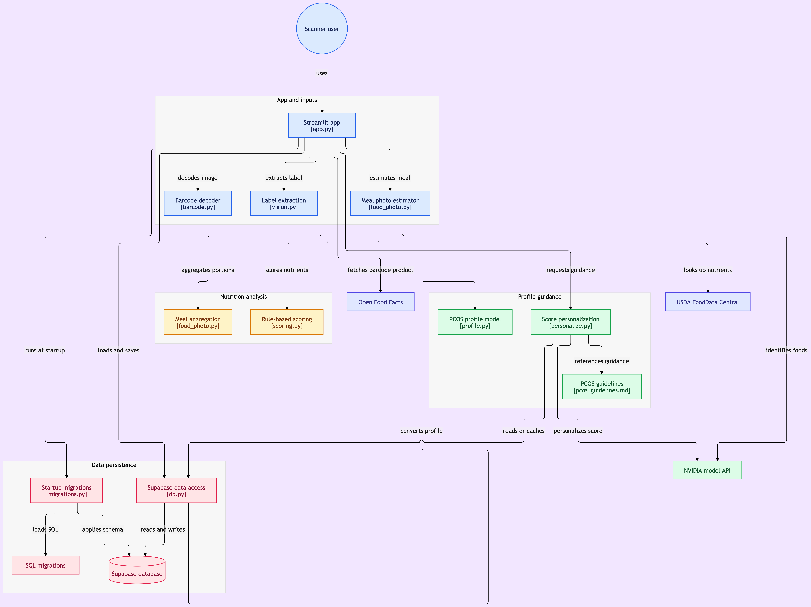

# PCOS Food Scanner (Python prototype)

Streamlit prototype: scan a barcode, photograph a product label, or photograph a meal → get a PCOS-aware score (1–10) with serving advice, and save foods to your profile. It validates the scoring logic before any mobile port.

## Architecture and walkthrough

[](docs/media/architecture.png)

**[Watch the one-minute project explainer →](docs/media/explainer.mp4)**

## How scoring works

The score is deterministic (`core/scoring.py`). Each food starts at 5 and moves by fixed rules on its per-100 g nutrients: protein and fibre raise it; added sugar, saturated fat, sodium, and ultra-processing (NOVA 4) lower it; whole foods (NOVA 1) raise it. The result is clamped to 1–10 and returned with a rule-by-rule breakdown.

The LLM never sets the base score. It is used for two things only:

- **Reading photos.** A vision model extracts nutrients from a label (`core/vision.py`) or identifies the items in a meal, whose nutrients are then looked up in USDA data (`core/food_photo.py`).
- **Personalizing.** The model adjusts and explains the score against the user's PCOS profile (`core/personalize.py`).

## Setup

```bash
cd pcos-scanner
python3 -m venv .venv && source .venv/bin/activate
pip install -r requirements.txt
cp .env.example .env   # fill in NVIDIA_API_KEY
streamlit run app.py
```

Run the tests with `pytest -q`. The 30 tests cover scoring, barcode parsing, label and meal photo parsing, personalization, database access, and migration grants.

## Layout

- `app.py` — Streamlit UI (Scan / Saved / Profile tabs)
- `core/openfoodfacts.py` — barcode → nutriments via Open Food Facts
- `core/scoring.py` — deterministic rule-based score
- `core/personalize.py` — NVIDIA OpenAI-compatible endpoint (`https://integrate.api.nvidia.com/v1`) adjusts score + writes explanation against user profile
- `core/profile.py` — load/save PCOS profile (4-type + symptom flags)
- `core/db.py` — Supabase CRUD for profile + saved foods + personalization cache
- `migrations/` — SQL migrations auto-run on app startup

## Deploy to Streamlit Cloud

Push this repo to GitHub.
Go to https://share.streamlit.io and create a new app.
Point the app at `app.py`.
Add `NVIDIA_API_KEY` in Streamlit Secrets.
Click Deploy.

### Supabase setup

1. Create a Supabase project at https://supabase.com.
2. Copy the Project URL and anon key from Settings → API.
3. Copy the Postgres URI from Settings → Database → Connection String → URI mode (transaction pooler).
4. Add these to Streamlit Cloud Secrets:
   - `SUPABASE_URL`
   - `SUPABASE_ANON_KEY`
   - `SUPABASE_DB_URL`
   - `SUPABASE_SERVICE_ROLE_KEY`

On first deploy, Supabase will auto-run migrations on startup. To add a schema change later, drop a new file like `migrations/002_add_column.sql` and push — it runs automatically on the next redeploy.

Tables used through the Supabase Data API are private to the server-side
`service_role`. Any migration that adds a Data API table must explicitly revoke
access from `anon` and `authenticated`, enable RLS, and grant `service_role` only
the operations used by `core/db.py`. The migration tests enforce the grants for
every table referenced there.

## Limitations

- This is a prototype, not medical advice. The scoring rules are a heuristic rubric, not a clinical instrument.
- Barcode results depend on Open Food Facts coverage; missing nutrients are skipped rather than guessed.
- Nutrients read from photos are model estimates, so a photo-based score is only as good as that extraction.
